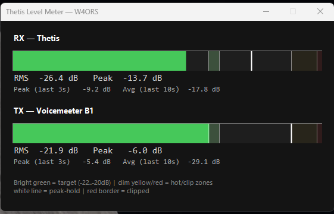

# Thetis Custom VU Meter

A lightweight, standalone dual VU-style level meter for [Thetis](https://github.com/ramdor/Thetis)
(OpenHPSDR) — live RX and TX audio bars, side by side, so you can dial in gain staging before a QSO
or a recording session without a full DAW or a hardware meter.

- **RX** streams straight from Thetis over the [TCI](https://github.com/ExpertSDR3/TCI) protocol
  (`audio_start` binary frames), so it shows exactly what the receiver is producing, continuously,
  regardless of transmit state.
- **TX** comes from a WASAPI capture of whatever device carries your mic audio into Thetis
  (Voicemeeter, a virtual audio cable, a direct interface — you pick it during setup, no editing
  required).
- Monitoring only. Nothing is recorded, encoded, or written to disk beyond an optional diagnostic
  log.



> **Tip:** pair this with [Thetis QSO Recorder](https://github.com/Chris-W4ORS/ThetisQSORecorder) —
> a background recorder that captures full QSOs to MP3, automatically switching between RX and TX
> as you transmit. Use this meter to confirm your levels are dialed in before or during a recording
> session.

## Enabling TCI in Thetis

The meter connects to Thetis over TCI, which is off by default. In Thetis:

**Setup → Serial/Network/Midi CAT → Network → TCI**

- Check **TCI Server Running** (or the equivalent enable checkbox for your Thetis version)
- Leave the port at the default **50001** unless you have a reason to change it — the installer/wizard
  defaults to that port too
- If this is the first time you've enabled it, Windows may prompt with a Firewall permission dialog
  for Thetis — allow it on at least your **Private** network

You only need to do this once; Thetis remembers the setting across restarts.

## Requirements

| | |
|---|---|
| OS | Windows 10 or 11 |
| PowerShell | [7.0+](https://github.com/PowerShell/PowerShell/releases) — Windows ships with 5.1 by default, which is **not** enough. The installer below will offer to install it for you. |
| Thetis | TCI server enabled — see [Enabling TCI in Thetis](#enabling-tci-in-thetis) below |
| Network | Internet access on first run only (downloads NAudio via NuGet) |

No admin rights needed for normal use — the installer and the meter both run per-user.

## Install

**Option A — one-liner** (recommended; opens PowerShell from the Start menu, then paste):

```powershell
irm https://raw.githubusercontent.com/Chris-W4ORS/Thetis-Custom-VU-Meter/main/Install.ps1 | iex
```

This downloads the meter, checks for/offers to install PowerShell 7, and creates a "Thetis VU
Meter" shortcut on your Desktop. Re-run it any time to update to the latest version — your saved
setup (device choice, TCI host/port) isn't touched, since that lives separately in
`%APPDATA%\ThetisQSORecorder\`.

**Option B — manual:**

1. Download `ThetisLevelMeter.ps1` from this repo.
2. Right-click → Properties → **Unblock** (or `Unblock-File .\ThetisLevelMeter.ps1`) — Windows
   flags files downloaded from the internet by default.
3. Run it:
   ```powershell
   pwsh .\ThetisLevelMeter.ps1
   ```

## First run

A short setup wizard runs automatically the first time:

1. Pick which recording device carries your mic audio into Thetis, from a numbered list of
   everything Windows sees — no hardcoded device names to edit.
2. Confirm the TCI host (press Enter to auto-detect) and port (default `50001`).
3. It live-tests the TCI connection right there, so a typo or a not-yet-enabled TCI server gets
   caught immediately instead of showing up later as a blank meter.

Every run after that is silent. To change devices or the TCI connection later, either double-click
the **"Thetis VU Meter (Reconfigure)"** shortcut on your Desktop (created alongside the main one if
you used the one-liner installer), or run:

```powershell
pwsh .\ThetisLevelMeter.ps1 -Reconfigure
```

Setup is saved to `%APPDATA%\ThetisQSORecorder\LevelMeter.config.json`.

## Diagnostics

The script keeps a plain-text diagnostic log at
`%APPDATA%\ThetisQSORecorder\logs\LevelMeter_yyyyMMdd.log` — one file per day, auto-pruned after
5 days. It logs connection state changes, TCI reconnect attempts, RX audio gaps, and UI-thread
stalls, so an intermittent "the meter looked wrong for a second" issue can be diagnosed after the
fact instead of needing to be caught live.

## How it works, briefly

- A `System.Windows.Forms.Timer` ticks at ~25fps, draining any pending TCI WebSocket message and
  any queued WASAPI audio, computing an RMS/peak-hold value for each side, and repainting two bar
  meters.
- TCI messages are properly reassembled across WebSocket fragments (not just assumed to always
  arrive as one complete frame) before the 64-byte Thetis header is stripped off.
- If the TCI socket drops, the script retries with exponential backoff (3s → 60s cap) instead of
  requiring a restart.

## Troubleshooting

**Script won't run at all, even after Unblock-File.**
Check your PowerShell execution policy — some locked-down machines default to `Restricted`, which
blocks all scripts, not just downloaded ones:
```powershell
Get-ExecutionPolicy
Set-ExecutionPolicy -Scope CurrentUser RemoteSigned
```

**TX meter is blank / a warning mentions the mic device couldn't be opened.**
Windows may be blocking desktop apps from using your microphone. Check **Settings → Privacy &
security → Microphone → "Let desktop apps access your microphone"** is turned on. Also make sure
no other application currently has that device open exclusively (some apps grab exclusive mode).

**The PowerShell window stays open after I close the meter.**
That's intentional — it's there so that if something goes wrong on startup, the error stays visible
instead of the window vanishing before you can read it. Just close that window too (or type `exit`)
once you're done.

**RX meter is blank.**
Almost always means Thetis's TCI server isn't running yet — see
[Enabling TCI in Thetis](#enabling-tci-in-thetis) above. Run with `-Reconfigure` to re-test the
connection once it's on.

## License

MIT — see [LICENSE](LICENSE).
